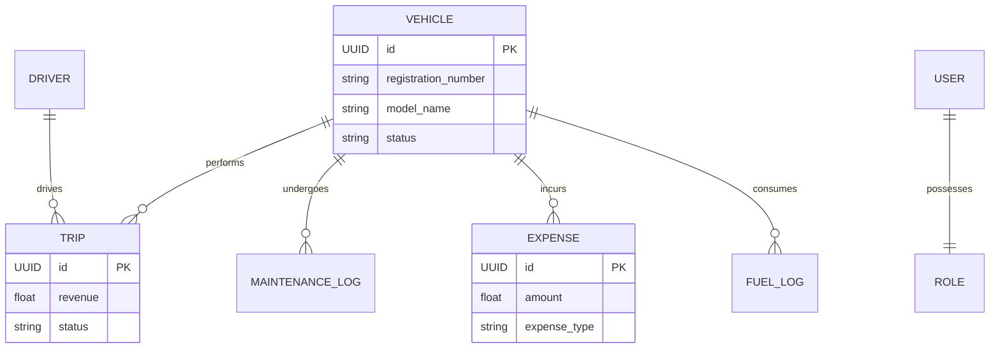
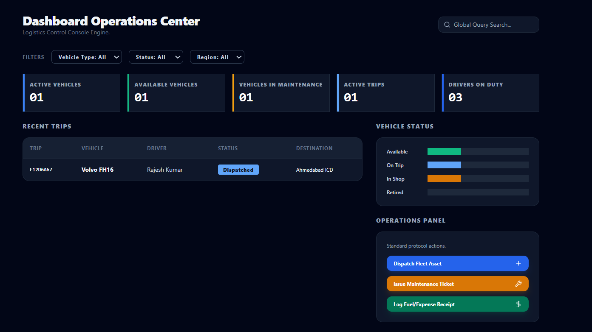
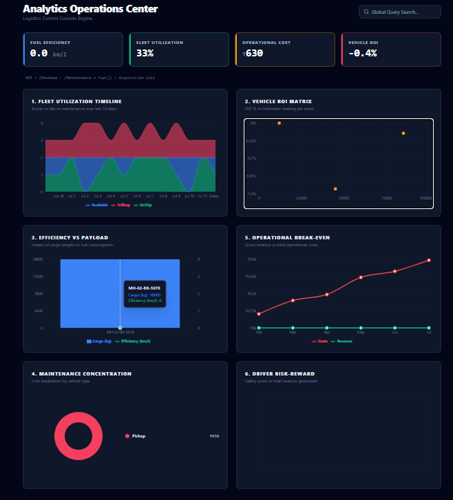

<div align="center">
  
  <h1>TransitOps: Enterprise Logistics Control Engine</h1>
  <p><em>A high-performance, modular fleet management platform engineered to optimize asset tracking, financial ROI, and dispatch operations.</em></p>
  
  
  
  
  
  
</div>

---

## 📖 The Problem vs. Our Solution (The "Why")

**The Problem:** Modern fleets suffer from heavily fragmented data. Dispatchers don't communicate with finance, maintenance logs get lost on paper, and calculating the true ROI of a fleet asset takes weeks of manual spreadsheet data entry.

**The Solution:** TransitOps centralizes all operational data points in real-time. When a vehicle is sent to the shop, it's instantly flagged as "In Shop" for dispatchers, and the repair costs are immediately pushed to the Financial Analyst's dashboard to recalculate the exact Return on Investment (ROI) of that truck. 

---

## Key Features

- 🔐 **Zero-Trust Role-Based Access Control (RBAC):** Backend routes are strictly guarded via dependency injection. A Dispatcher absolutely cannot view or access the Financial endpoints.
- 🧮 **Live Algorithmic Analytics:** The backend mathematically aggregates thousands of rows across `fuel_logs`, `expenses`, and `trips` to calculate Net Profit and Asset ROI dynamically in milliseconds.
- ⚡ **Optimized Database Joins:** We abandoned slow multiple queries in favor of SQLAlchemy `joinedload` queries, ensuring complex data structures are returned instantly.
- 🎨 **Premium Glassmorphism UI:** Built with custom TailwindCSS, featuring micro-animations, dark-mode integration, and fully responsive data grids.

---

## 📊 Database Entity Relationship Diagram (ERD)

Because data integrity is paramount, we strictly mapped our SQL tables using Foreign Keys and Cascades. Here is our architectural blueprint:



---

## 📸 Dashboard Previews

*(Replace these placeholders with your actual screenshots for the judges!)*

| 🚚 Dispatcher Console | 💰 Financial Operations Center |
| :---: | :---: |
|  |  |

---

## 🛡️ API Endpoints & RBAC Matrix

Our API is highly modularized. Here is exactly who can access what:

| Endpoint Path | Method | Required Role(s) | Description |
| :--- | :---: | :--- | :--- |
| `/api/v1/auth/login` | `POST` | *Public* | Issues secure JWT session tokens. |
| `/api/v1/vehicles/` | `POST/GET` | 👨‍💼 **Fleet Manager** | Registers and lists heavy-duty assets. |
| `/api/v1/drivers/` | `POST/GET` | 👨‍💼 **Fleet Manager**, 🚚 **Dispatcher** | Manages driver licenses and status. |
| `/api/v1/trips/` | `POST/GET` | 🚚 **Dispatcher**, 👨‍💼 **Fleet Manager** | Dispatches routes and calculates AI pairing. |
| `/api/v1/maintenance/` | `POST/GET` | 👨‍💼 **Fleet Manager**, 🦺 **Safety Officer** | Opens diagnostic tickets; flags trucks "In Shop". |
| `/api/v1/expenses/outflow` | `POST` | 💰 **Financial Analyst** | Logs fuel and incidental workflow costs. |
| `/api/v1/expenses/logs` | `GET` | 💰 **Financial Analyst** | Fetches split ledgers natively joined to Assets. |
| `/api/v1/expenses/roi-blueprint`| `GET` | 💰 **Financial Analyst** | Analyzes live fleet ROI %, efficiency, and profit. |

---

## 📂 System Architecture

```text
ODDO/
├── Frontend/                 # React & Vite
│   ├── src/
│   │   ├── components/       # Custom Modals & Reusable Widgets
│   │   ├── pages/            # View logic for the 4 distinct Roles
│   │   └── utils/api.js      # Centralized HTTP request interceptors
│   └── index.css             # Design System Tokens
│
└── backend/                  # FastAPI Python
    ├── app/
    │   ├── api/v1/           # API Routers grouped by operational module
    │   ├── core/             # JWT Security & Environment Configs
    │   ├── db/               # Supabase PostgreSQL Session Engines
    │   ├── models/           # SQLAlchemy ORM Data Shapes
    │   ├── schemas/          # Pydantic V2 Input/Output Validators
    │   └── services/         # Decoupled Business Logic (The Brains)
    └── seed.py               # Wipes and populates the mock database
```

---

## 🚀 Run It Locally 

### 1. Database Setup
We use a live Supabase database. You can completely refresh the mock data and accounts:
```bash
cd backend
python seed.py
```
*This generates your testing accounts: `manager@...`, `dispatcher@...`, `safety@...`, `finance@...` (Password: `admin`)*

### 2. Launch Backend Engine
```bash
cd backend
python -m venv env
source env/Scripts/activate  # (Windows)
pip install -r requirements.txt
uvicorn app.main:app --reload
```
*Accessible at: `http://localhost:8000/docs` (Swagger UI)*

### 3. Launch Frontend Interface
```bash
cd Frontend
npm install
npm run dev
```
*Accessible at: `http://localhost:5173`*

---
